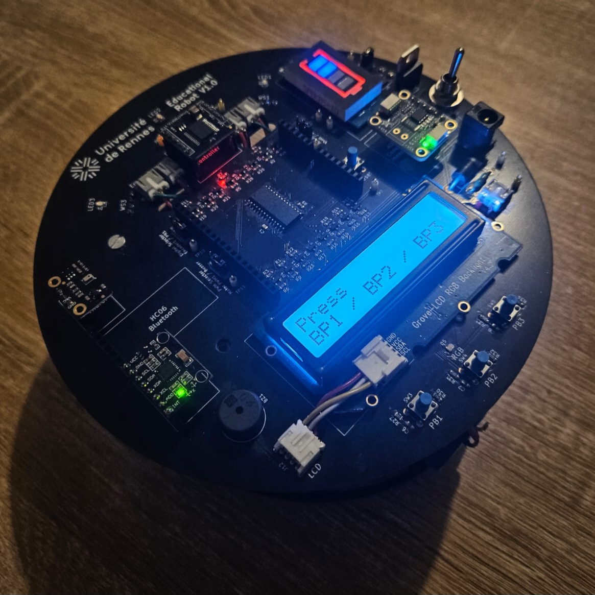

# 🤖 Robot STM32 contrôlé par application mobile

Ce projet consiste en la conception et le développement d’un robot mobile basé sur une carte STM32 (NUCLEO-L152RE), contrôlé via une application mobile développée avec **MIT App Inventor**.

---

## 🚀 Fonctionnalités principales

- 🧠 Trois modes de fonctionnement :
  - Mode **manuel** (contrôle direct via boutons dans l'app)
  - Mode **automatique** (déplacement autonome dans un labyrinthe)
  - Mode **commande vocale** (reconnaissance vocale via l'application)

- 📡 Communication sans fil via **Bluetooth (HC-05)**
- ⚙️ Contrôle moteur avec **PWM** et **encodeurs**
- 📏 Capteurs utilisés :
  - **Ultrasons (HC-SR04)** pour la détection d’obstacles
  - **Capteurs IR** pour le suivi de ligne ou l’odométrie
- 🔋 Affichage d'informations en temps réel :
  - Distance parcourue
  - Vitesse
  - État de la batterie

---

## 🛠️ Technologies & Matériel

### 🔧 Matériel
- Carte STM32 Nucleo L152RE
- Module Bluetooth HC-05
- 2 moteurs CC + encodeurs
- Capteur à ultrasons HC-SR04
- Capteurs infrarouges (IR)
- Batteries Li-ion 7.4V

### 🧰 Logiciel
- STM32CubeIDE pour le code embarqué
- MIT App Inventor pour l’application Android
- Communication UART non bloquante avec interruptions
- Timer 6 pour la transmission périodique

---

## 📱 Application Mobile

L'application Android permet :
- D’envoyer des commandes au robot (avant, arrière, gauche, droite, stop)
- De recevoir des données depuis le robot (distance, batterie, etc.)
- De changer de mode de fonctionnement
- De contrôler le robot par reconnaissance vocale

📦 Le fichier `.aia` (code source de l’application) est disponible dans ce dépôt.

## 📚 Auteur

- **Nom :** Abderrahmane Benchikh  
- **Formation :** Licence 3 Électronique (EEEA), Université de Rennes  
- **Objectif :** Développement embarqué et logiciel – candidature en Master Informatique (alternance)
